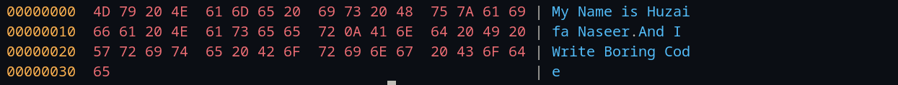
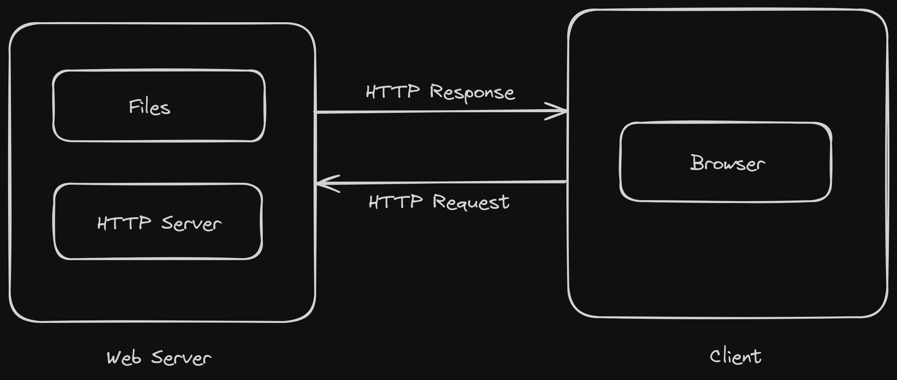
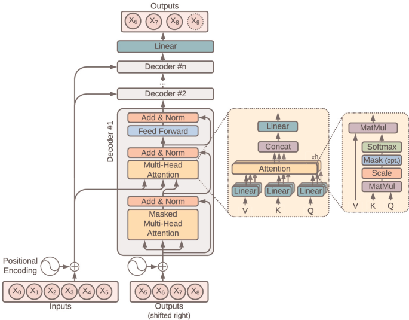

## RUSQL
RUSQL is a SQLite-like database implemented in the Rust programming language. It provides a colorful and interactive interface for viewing and printing database schemas, making it easy to visualize the structure of your data. RUSQL aims to provide a lightweight, efficient, and easy-to-use database solution for Rust applications. It supports a subset of SQL syntax and provides basic database functionalities such as creating tables, inserting data, and querying data.
Check out the [RUSQL GitHub Repository](https://github.com/HN026/Rusql)

## LocalLru
A high-performance, thread-safe LRU (Least Recently Used) cache implementation in C++ using thread-local storage for lock-free operations.
Check out the [LocalLru GitHub Repository](https://github.com/HN026/LocalLru)

## UNIX Shell
Developed a custom Unix shell crafted in C, offering advanced features such as command execution, job control, and built-in commands for seamless navigation. With robust signal handling and a customizable prompt, users experience enhanced control and efficiency. Leveraging symbol tables, word expansion, and tilde expansion, this shell optimizes command parsing and offers dynamic input capabilities.
Check out it's Github Repository [here](https://github.com/HN026/Unix-Shell)

## HexDmp
This is a simple command-line utility for dumping the contents of a file in hexadecimal format along with ASCII representation.
Check out it's Github Repository [here](https://github.com/HN026/HexDmp)

## WebServer
This project is a simple HTTP server implemented in C++ & Rust Both. It listens for incoming connections on a specified port, accepts these connections, and logs the IP address and port number of each client that connects. Check out the [C++](https://github.com/HN026/cpp-WebServer) and [Rust](https://github.com/HN026/RustWebServer) versions of this Repository.

## Transformer
This project implements the full encoder-decoder architecture of Transformers. This advanced neural network design excels at sequential data tasks. Unlike recurrent models like LSTMs, it leverages self-attention mechanisms, enabling faster training. The core of my implementation lies in the multi-head self-attention within both encoder and decoder layers. This allows the model to capture long-range dependencies and understand the relationships between elements in the sequence.
Check out it's Github Repository [here](https://github.com/HN026/Transformer)

## MandelBrot
My project investigates the generation of Mandelbrot fractals through a neural network approach. This approach incorporates the mathematical foundations of Taylor and Fourier series. By leveraging these techniques, I aim to achieve a novel and potentially more efficient method for producing these intricate fractal structures. The project explores the synergy between neural network capabilities and classical mathematical tools in the fascinating domain of fractal generation.
Check out it's Github Repository [here](https://github.com/HN026/Mandelbrot)

